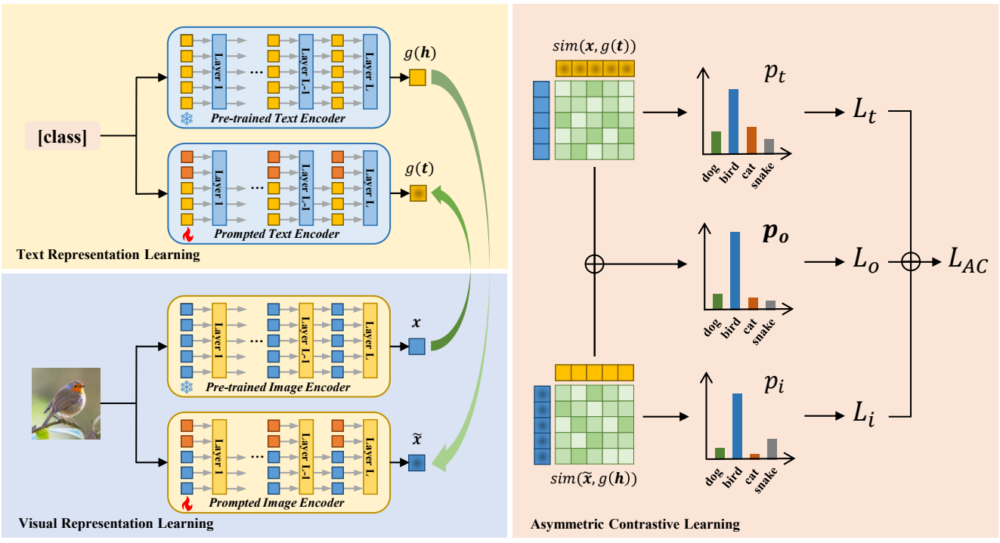

# Learning Domain Invariant Prompt for Vision-Language Models (TIP)


> [**Learning Domain Invariant Prompt for Vision-Language Models**](https://arxiv.org/pdf/2212.04196.pdf)<br>
> Cairong Zhao, Yubin Wang, Xinyang Jiang, Yifei Shen, Kaitao Song, Dongsheng Li, and Duoqian Miao


Official implementation of the paper "[**Learning Domain Invariant Prompt for Vision-Language Models**](https://arxiv.org/pdf/2212.04196.pdf)".


<hr />

## ✨ Highlights


> **<p align="justify"> Abstract:** *Prompt learning stands out as one of the most efficient approaches for adapting powerful vision-language foundational models like CLIP to downstream datasets by tuning learnable prompt vectors with very few samples. However, despite its success in achieving remarkable performance on in-domain data, prompt learning still faces the significant challenge of effectively generalizing to novel classes and domains. Some existing methods address this concern by dynamically generating distinct prompts for different domains. Yet, they overlook the inherent potential of prompts to generalize across unseen domains. To address these limitations, our study introduces an innovative prompt learning paradigm, called MetaPrompt, aiming to directly learn domain invariant prompt in few-shot scenarios. To facilitate learning prompts for image and text inputs independently, we present a dual-modality prompt tuning network comprising two pairs of coupled encoders. Our study centers on an alternate episodic training algorithm to enrich the generalization capacity of the learned prompts. In contrast to traditional episodic training algorithms, our approach incorporates both in-domain updates and domain-split updates in a batch-wise manner. For in-domain updates, we introduce a novel asymmetric contrastive learning paradigm, where representations from the pre-trained encoder assume supervision to regularize prompts from the prompted encoder. To enhance performance on out-of-domain distribution, we propose a domain-split optimization on visual prompts for cross-domain tasks or textual prompts for cross-class tasks during domain-split updates. Extensive experiments across 11 datasets for base-to-new generalization and 4 datasets for domain generalization exhibit favorable performance. Compared with the state-of-the-art method, MetaPrompt achieves an absolute gain of 1.02% on the overall harmonic mean in base-to-new generalization and consistently demonstrates superiority over all benchmarks in domain generalization.* </p>

## :rocket: Contributions

- We introduce an innovative prompt learning paradigm, called MetaPrompt, which directly learns domain invariant prompt in few-shot scenarios. This paradigm aims to tackle the major challenge of generalizing to unseen classes or domains in prompt learning with vision-language models. 
- We present a dual-modality prompt tuning network comprising two pairs of coupled encoders to facilitate learning prompts for image and text inputs independently. 
- We center on an alternate episodic training algorithm to enrich the generalization capacity of the learned prompts, which alternates between in-domain updates and domain-split updates for prompt tuning.

## 📊 Results
### Base-to-New Generalization
Results reported below show average accuracy for base and new classes across 11 recognition datasets averaged over 3 seeds. Please refer to our paper for more numerical results

| Name                                               |   Base Accuracy   |   New Accuracy    |   Harmonic Mean   |
| -------------------------------------------------- | :---------------: | :---------------: | :---------------: |
| [CLIP](https://arxiv.org/abs/2103.00020)           |       69.34       |       74.22       |       71.70       |
| [CoOp](https://arxiv.org/abs/2109.01134)           |       82.69       |       63.22       |       71.66       |
| [CoCoOp](https://arxiv.org/abs/2203.05557)         |       80.47       |       71.69       |       75.83       |
| [MaPLe](https://arxiv.org/abs/2210.03117)          |       82.28       |       75.14       |       78.55       |
| [MetaPrompt](https://arxiv.org/pdf/2212.04196.pdf) | **83.38 (+1.10)** | **76.09 (+0.95)** | **79.57 (+1.02)** |

### Domain Generalization

Results reported below show accuracy across 4 domain generalization benchmark datasets averaged over 3 seeds and all domains.

|                                                             |   PACS   |   VLCS   | OfficeHome | DomainNet |
| :---------------------------------------------------------- | :------: | :------: | :--------: | :-------: |
| [CLIP](https://arxiv.org/abs/2103.00020)                    |   95.7   |   75.9   |    79.4    |   56.8    |
| [CLIP (template)](https://arxiv.org/abs/2109.01134)         |   96.1   |   82.3   |    82.1    |   56.9    |
| [CoCoOp (5-shot)](https://arxiv.org/abs/2203.05557)         |   96.7   |   78.3   |    84.1    |   61.1    |
| [MetaPrompt (1-shot)](https://arxiv.org/pdf/2212.04196.pdf) |   96.9   |   81.1   |    84.1    |   61.2    |
| [MetaPrompt (5-shot)](https://arxiv.org/pdf/2212.04196.pdf) | **97.0** | **82.6** |  **85.2**  | **61.8**  |

## 🛠️ Installation 

For installation and other package requirements, please follow the instructions detailed in [INSTALL.md](docs/INSTALL.md). 

## 🗂️ Data preparation
Please follow the instructions at [DATASETS.md](docs/DATASETS.md) to prepare all datasets.


## 🧪 Training and Evaluation
Please refer to [RUN.md](docs/RUN.md) for detailed instructions on training and evaluating.

## 🔍 Citation
If you use our work, please consider citing:

```bibtex
@article{zhao2022learning,
    title={Learning domain invariant prompt for vision-language models},
    author={Zhao, Cairong and Wang, Yubin and Jiang, Xinyang and Shen, Yifei and Song, Kaitao and Li, Dongsheng and Miao, Duoqian},
    journal={arXiv preprint arXiv:2212.04196},
    year={2022}
}
```

## 📧 Contact
If you have any questions, please create an issue on this repository or contact us at wangyubin2018@tongji.edu.cn or zhaocairong@tongji.edu.cn.


## 😃 Acknowledgments

Our code is based on [CoCoOp and CoOp](https://github.com/KaiyangZhou/CoOp) repository. We thank the authors for releasing their code. If you use our model and code, please consider citing these works as well.

